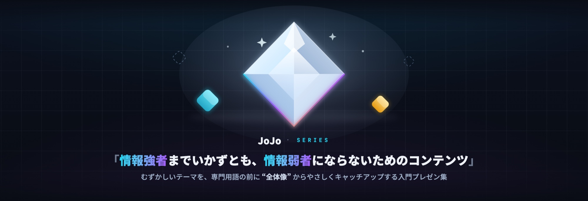

<a href="https://himiyosh.github.io/JoJo-AIAgent/">
  
</a>

# 🎤 AIエージェント、いま何が起きている?

> **JoJo「情報強者までいかずとも、情報弱者にならないためのコンテンツ」シリーズ #01**
> AIエージェント構築の“いま”を、初心者向けに **概念・全体像** からやさしくキャッチアップする HTML プレゼンテーション。

<a href="https://himiyosh.github.io/JoJo-AIAgent/">
  
</a>

<p align="center">
  <a href="https://himiyosh.github.io/JoJo-AIAgent/"><b>▶ 16:9 スライドで見る</b></a>
  ・
  <a href="https://himiyosh.github.io/JoJo-AIAgent/reader/"><b>📱 スマホReaderで拡大して読む</b></a>
  ・
  <a href="./CHANGELOG.md"><b>📝 変更履歴</b></a>
</p>

---

## ▶︎ プレゼンを見る

### 🔗 公開 URL

- **16:9 プレゼン**: <https://himiyosh.github.io/JoJo-AIAgent/>
- **スマホ Reader View（全31枚）**: <https://himiyosh.github.io/JoJo-AIAgent/reader/>
- **横型スマホ拡大pilot（Slide 06/16/26・比較用）**: <https://himiyosh.github.io/JoJo-AIAgent/mobile-pilot/>
- **旧縦向け Reader（比較用）**: <https://himiyosh.github.io/JoJo-AIAgent/reader-legacy/>
- **縦向け Reader pilot（比較用）**: <https://himiyosh.github.io/JoJo-AIAgent/reader-pilot/>

インストール不要。ブラウザで開くだけで見られます。

- **← →** キー、または画面クリックでスライドを送る
- **`f`** で全画面 / **`o`** でスライド一覧（オーバービュー）
- 一部スライドは **クリックで段階的に内容が現れます**（クリック式リビール）
- スマホReaderは、完成済みの16:9スライド全31枚を画像化・再編集せず、通常Slidevと同じDOMへReader操作を直接重ねて表示します。iframeや内側のカードは使わず、全体を確認してからピンチ／ダブルタップ／±で最大400%まで拡大し、拡大中はドラッグで移動できます。全画面操作は対応ブラウザでのみ表示します。
- **目次**では全31枚を「サムネイル＋章＋タイトル」の1列リストで確認して直接移動でき、見出し・本文・全タブ状態・発表者ノート・出典も検索できます。下部の**全体表示**は拡大を100%へ戻してスライド全体を画面内に収める操作で、下段に現在倍率を表示します。**補足**では現在のスライドの解説と出典を開けます。← → / PageUp / PageDown、`#slide-N`、ブラウザの戻る／進むにも対応します。
- 旧縦向けReader／Reader pilot／3枚zoom pilotは比較用に維持しています。
- ダーク背景前提のデザインです（明るい環境なら画面を暗めに）

---

## 📚 シリーズ

「**情報強者までいかずとも、情報弱者にならないためのコンテンツ**」──
むずかしいテーマを、コードや専門用語にいきなり踏み込む前に **“全体像”から** つかむための入門プレゼン集です。

| # | タイトル | 見る | ソース |
|:--:|---|:--:|---|
| **#01** | 🎤 AIエージェント、いま何が起きている?（**このリポジトリ**） | [**🔗 見る**](https://himiyosh.github.io/JoJo-AIAgent/) | [himiyosh/JoJo-AIAgent](https://github.com/himiyosh/JoJo-AIAgent) |
| **#02** | 🌿 Git、こわくない | 🚧 近日公開 | JoJo-Git |

> 各回は独立して読めます。共通のブランド（JoJo＋ダイヤ印）とダーク・テック系デザインで揃えています。

---

## 🧭 この回で話すこと

軸となるストーリーは **「作り方の進化史」**＝ **Prompt → Context → Harness → Loop**。
> むかしは “指示（プロンプト）” を変えるだけでよかった。**いまは “ループ” の設計が主役。**

| 章 | テーマ |
|:--:|---|
| **00** | イントロ（ゴール・対象・免責） |
| **01** | そもそも AI エージェントとは?（「賢いチャット」と何が違う?） |
| **02** | 作り方の全体像（Prompt → Context → Harness → Loop の地図） |
| **03** | いまの“動かし方”（ReAct → Harness → **Loop Engineering**） |
| **04** | 一体で作る? 分ける?（単一 vs マルチ／サブエージェント・オーケストレーション） |
| **05** | 作るときの勘所（MCP・評価・ガードレール・コスト・落とし穴）＋ まとめ・次の一歩 |

- 言語: **日本語**（技術用語は英語併記）
- 基準日: **2026年7月時点**のスナップショット（AI は動きが速いため、あえて時期を明記しています）

---

## 🛠 開発・自分で公開する

<details>
<summary>ローカルで動かす／ビルド／GitHub Pages 公開の手順</summary>

必要環境: **Node.js 20 以上** / npm

```bash
npm install          # 依存関係をインストール
npm run dev          # 開発サーバー（http://localhost:3030）— slides.md 保存で即反映

npm run build            # 16:9、全31枚スマホReader、比較用Readerを単一ソースから生成
npm run build -- slides-compare.md --out dist-compare  # 別entryはデッキだけを生成（Readerはcanonical専用）
npm run preview:production -- --base /JoJo-AIAgent/  # Pages と同じ base path で確認
npm run qa:production -- --base /JoJo-AIAgent/       # 31枚・操作UI・Readerを検証
npm run qa:reader-pilot -- --base /JoJo-AIAgent/     # pilot v3 180/180 coverage・15ページ・実文字可視性・操作を検証
npm run qa:mobile-pilot -- --base /JoJo-AIAgent/     # 横型3枚のfit・pinch・pan・dialog・historyを検証
npm run qa:mobile-reader -- --base /JoJo-AIAgent/    # 横型全31枚・目次・検索・zoom/pan・root/baseを検証
npm run qa:build-wrapper                              # entry判定・Windows互換CLI起動を検証
npm run export           # PDF などにエクスポート（要 playwright-chromium）
npm run export:handout   # 配布用ハンドアウト PDF（クリック式タブの全状態を1ページずつ）→ handout.pdf
```

### GitHub Pages で公開する

`.github/workflows/deploy.yml`（自動デプロイ）が含まれています。

1. **Settings → Pages → Build and deployment → Source** を **「GitHub Actions」** に設定（初回のみ）
2. `main` に push すると Actions が自動でビルド＆デプロイ（手動実行も可）
3. 公開 URL: `https://<owner>.github.io/<repo>/`

> base パス（サブディレクトリ）はワークフローが**リポジトリ名を自動注入**します。

### さわる場所

| やりたいこと | 編集する場所 |
|---|---|
| スライドの内容 | `slides.md` |
| 配色・見た目 | `style.css`（CSS 変数 `--brand-a` / `--brand-b` ほか）／方針は `DESIGN.md` |
| Reader View | `setup/main.ts`から`reader/direct-viewer.*`を通常Slidev DOMへ直接統合。`reader-data.json`は目次・検索・補足だけを担い、980×552の本文・図・RevealTabs・Citeは複製しない。目次用320×180サムネイルだけをcanonical表示からbuild時に派生生成し、iframeなしでpinch／double-tap／ボタン拡大、pan、全画面を提供 |
| 旧縦向け Reader | canonical DOMから生成した31枚portrait版を`/reader-legacy/`へ比較用として維持 |
| Reader pilot | `reader/content-model.mjs`のstable atomic inventoryを、本文を持たない`reader/pilot-page-plan.mjs`で15ページへ明示割当。6 source固有renderer、`coverage-report.json`、実文字矩形・画面利用率QAで180/180と重なり／クリップ／下部大空白の不在を保証 |
| 横型スマホ拡大pilot | Slide 06/16/26で旧iframe方式を比較できる検証用route。正式Readerは承認後にiframeを廃止し、通常Slidevへ直接統合済み |
| ロゴ（JoJo＋ダイヤ印） | `components/BrandLogo.vue` |
| 執筆者・アバター | `components/AuthorBadge.vue` ／ `public/author-avatar.jpg` |
| ページ番号フッター | `global-bottom.vue` |
| 図表 | [Mermaid](https://mermaid.js.org/) コードブロック＋`style.css` のユーティリティクラス |

**技術スタック**: [Slidev](https://sli.dev/) (`@slidev/cli`) · Vue 3 · UnoCSS · Mermaid · GitHub Actions

</details>

---

<sub>© JoJo シリーズ / himiyosh ・ Built with <a href="https://sli.dev/">Slidev</a></sub>
